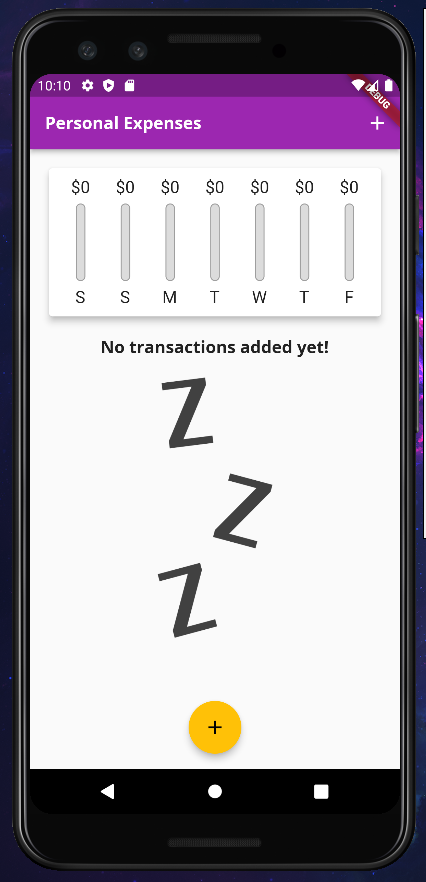
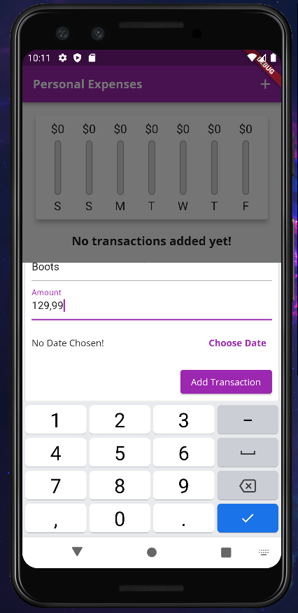
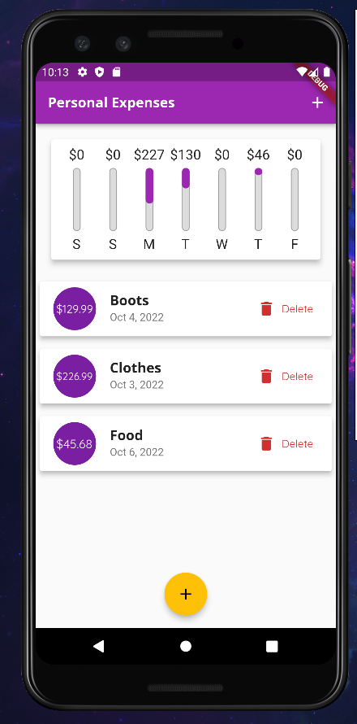

# Expanse Planner
## Developed in Flutter.

The application in which we can add our expenses, we can see how much we spent on a given day of the week and what is the percentage of money spent on a given day to the entire week.

## Screens

